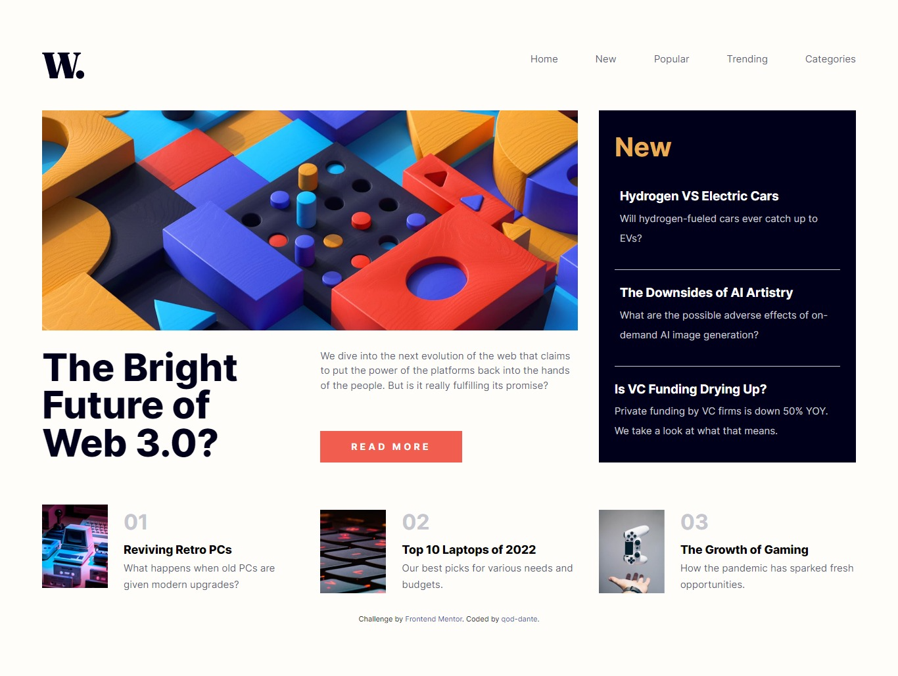

# Frontend Mentor - News homepage solution

This is a solution to the [News homepage challenge on Frontend Mentor](https://www.frontendmentor.io/challenges/news-homepage-H6SWTa1MFl). Frontend Mentor challenges help you improve your coding skills by building realistic projects. 

## Table of contents

- [Overview](#overview)
  - [The challenge](#the-challenge)
  - [Screenshots](#screenshots)
  - [Links](#links)
- [My process](#my-process)
  - [Built with](#built-with)
  - [What I learned](#what-i-learned)
  - [Continued development](#continued-development)
  - [Useful resources](#useful-resources)
- [Author](#author)

## Overview

### The challenge

Users should be able to:

- View the optimal layout for the interface depending on their device's screen size
- See hover and focus states for all interactive elements on the page
- **Bonus**: Toggle the mobile menu (requires some JavaScript)

### Screenshots

#### Desktop

#### Mobile

### Links

- Live Site URL: [Github](https://qod-dante.github.io/News-Hompage-by-qod-dante)

## My process

### Built with

- Semantic HTML5 markup
- CSS3
- CSS Grid

### What I learned

You know, reading or learning about something, and ACTUALLY doing it, are 2 different things.
On that note, I LEARNED about the CSS Grid layout, but never actually USED it. This project finally allowed me the chance
to actually do it! Alone even! Before this I used to use Float layouts and a little bit of flex, just so you know.

Something else I learned during the course of this project is something that - to this day - made me nervouse to learn,
is none other than CSS Media Queries.
Don't get me wrong! I always knew that websites appear differently depending on the device they are shown, but making a website
responsive was something that I thought would be too difficult for me to learn! And you know what? Yes. Responsive Web Design
is not easy to learn, but the results... will ALWAYS be worth it.

As for JavaScript... well... new territory for me. Enough said. Look at my JS file in the folder: 'scripts' and you'll see what I mean.

### Continued development

JavaScript and React js for now. Enough Said.

### Useful resources

- [W3Schools](https://w3schools.com) - I'm pretty every developer worth their salt knows this site. But just in case I'm wrong, this is where I found answers and
examples to the many Grid and Media Query questions I had. It's one of the greatest resources for referencing.

## Author

- Github - [qod-dante](https://github.com/qod-dante/)
- LinkedIn - [Den Manda](https://www.linkedin.com/in/den-manda-172147240/)

